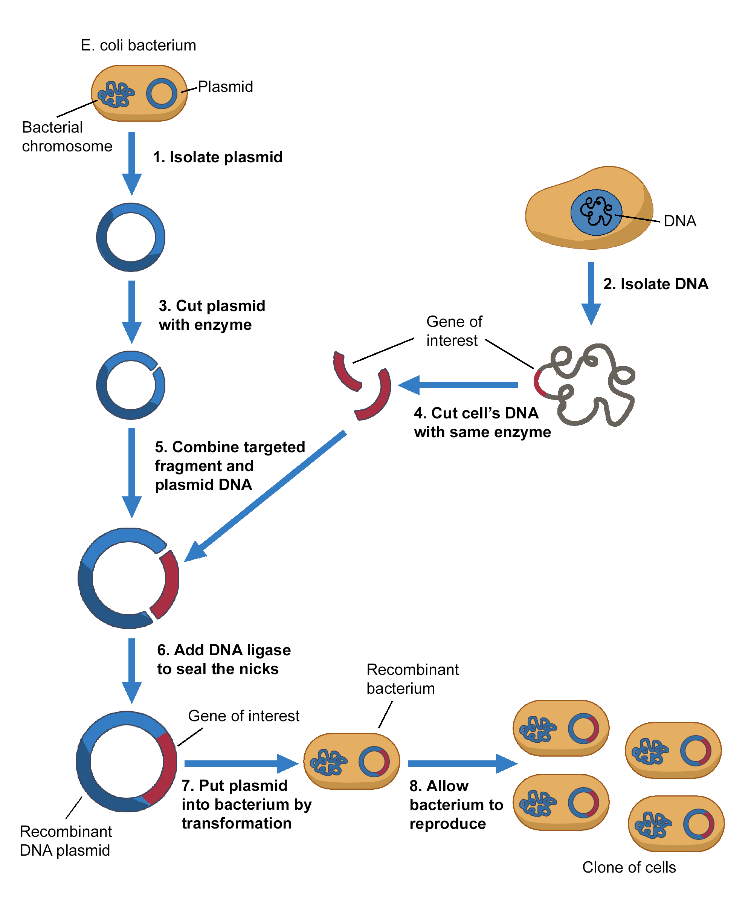

### Procedure

 
The vector acts as a vehicle that transport the foreign gene into a host cell usually a bacterium. When the host cell divides, the recombinant vector also multiplies, generating a huge number of identical copies not only of itself but also of the gene inserted into the vector. After many cell divisions, a clone or a colony of host cells is produced where each clone contains one or more copies of the recombinant DNA molecule.
  

Cloning of GFP gene in a suitable expression vector demands that 
* Isolation of gene of interest (GFP)to be cloned
* The vector DNA must be purified and cut open using a suitable set of restriction endonucleases. The expression vector should also contain selectable marker genes such as ampicillin and kanamycin resistance gene.
* The GFP gene must also be cleaved using same set of restriction endonucleases used to cut the vector DNA. This cleaved GFP gene is then inserted into the suitable vector to create the recombinant DNA molecule by joining reactions known as ligation
* The cutting and joining reactions must be monitored using gel electrophoresis method
* The recombinant DNA molecule produced must be introduced into a suitable host cell like E.coli (transformation).
* The selective propagation of the cell clones involves two stages: 
	(i) The transformed cells are plated by spreading on an agar surface to encourage the growth of the well separated colonies containing the GFP gene. This agar must have the same suitable selectable marker incorporated such as antibiotics like ampicillin, kanamycin to specifically allow the growth of those clones containing the target gene (GFP). 
	(ii) The individuals colonies can be picked from the plate and further propagated in liquid culture for selective isolation of recombinant DNA. 
 
The recombinant DNA is then screened for positive clones by methods such as PCR, restriction mapping etc.

 

  
The image illustrates the process of gene cloning using a recombinant DNA plasmid in E. coli bacteria.
<ol>
  <li><b>Isolate the plasmid –</b> A plasmid (small circular DNA) is extracted from an <i>E. coli</i> bacterium.</li>
  <li><b>Isolate the DNA –</b> The desired gene is extracted from a donor cell.</li>
  <li><b>Cut the plasmid with an enzyme –</b> A restriction enzyme is used to create sticky ends in the plasmid DNA.</li>
  <li><b>Cut the donor DNA with the same enzyme –</b> The gene of interest is cut out using the same restriction enzyme, ensuring compatibility.</li>
  <li><b>Combine the targeted fragment and plasmid DNA –</b> The gene of interest is inserted into the plasmid.</li>
  <li><b>Seal the DNA with ligase –</b> DNA ligase joins the plasmid and gene of interest, forming a recombinant DNA plasmid.</li>
  <li><b>Introduce the recombinant plasmid into bacteria –</b> The plasmid is inserted into <i>E. coli</i> via transformation.</li>
  <li><b>Bacteria reproduce –</b> The recombinant bacteria multiply, creating clones that contain the inserted gene, allowing for gene expression or protein production.</li>
</ol>

 

### Procedure for Cloning and Expression of GFP in a Eukaryotic Expression Vector
 

#### Part 1: Cloning GFP into the Expression Vector
<ul>
  <li>Cut the eukaryotic expression vector with restriction enzymes (like BamHI, EcoRI, and SalI) to create sticky ends.</li>
  <li>Mix the digested vector and GFP, add DNA ligase, and incubate overnight at 4°C.
  </li>
</ul>
 

#### Part 2: Expression of GFP in Eukaryotic Cells
<ul>
  <li>Transform the recombinant plasmid into E. coli using heat shock or electroporation. Plate the transformed bacteria onto kanamycin-containing LB agar plates and incubate overnight at 37°C.</li>
  <li>Grow eukaryotic cells in a T-25 flask with complete media overnight.</li>
  <li>Discard the media, wash the cells twice with PBS, trypsinize to detach them, and neutralize with complete media. Seed cells in a new dish and let them adhere for 12–24 hours.</li>
  <li>Prepare two transfection vials: one with P3000, Opti-MEM, and the GFP plasmid, and the other with Lipofectamine and Opti-MEM. Let both sit for 5 minutes.</li>
  <li>Mix the two vials and let the mixture incubate for 20 minutes at room temperature.</li>
  <li>Discard the media from the dish and wash the cells with Opti-MEM. Add the transfection mix dropwise onto the cells.</li>
  <li>Incubate at 37°C for 4–6 hours, then replace with fresh complete media and continue incubation for 24–48 hours.</li>
  <li>Visualize GFP expression under a fluorescence microscope, Cells expressing GFP should fluoresce green.</li>
</ul>

  

  <figure class="video_container" style="width: 600px; height: 350px;">
    <iframe style="width: 100%; height: 100%;" src="https://www.youtube.com/embed/videoseries?si=ARcYZU8YJan2BEE5&amp;list=PLTkVi3dAX_--8AgO31qBpg-L2dsEZi_TU" title="YouTube video player" frameborder="0" allow="accelerometer; autoplay; clipboard-write; encrypted-media; gyroscope; picture-in-picture; web-share" referrerpolicy="strict-origin-when-cross-origin" allowfullscreen></iframe>
  </figure>

